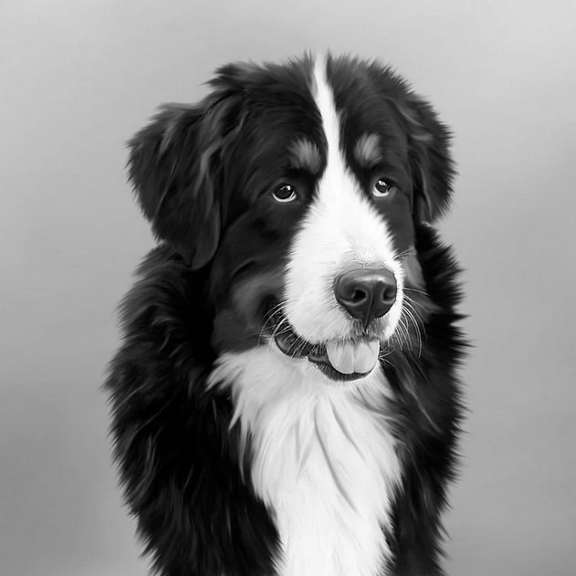
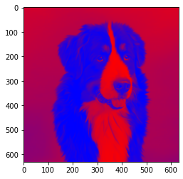
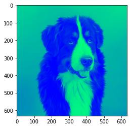

<h1>Колоризация изображений</h1>
<h2>Входящие файлы</h2>
<li>4140_CV_ЛР1_Строкова_PIL.ipynb - ноутбук с программным кодом на Python, реализация алгоритма через библиотеку PIL;
<li>4140_CV_ЛР1_Строкова_Нативно.ipynb - ноутбук с программным кодом на Python, реализация алгоритма с использованием базовых библиотек;
<li>4140_CV_ЛР1_Строкова_C++ - каталог с программным кодом на C++;
<li>4140_CV_ЛР1_Строкова.pdf - текстовый отчет;
<li>Каталог "Изображения" - исходные и итоговые изображения.
<h2>Постановка задачи</h2>
Цель работы: научиться реализовывать один из простых алгоритмов обработки изображений. 
 
Базовый алгоритм: колоризация. 
 
Задание: на вход поступает изображение, программа отрисовывает окно, в которое выводится либо исходное изображение после преобразования в черно-белое, либо после колоризации. 
 
Задачи: 
<li>реализовать алгоритм с использованием встроенных функций какой-либо библиотеки (OpenCV, PIL и др.);
<li>реализовать алгоритм с помощью примитивных операций и циклов на Python;
<li>реализовать алгоритм с помощью компилируемого кода (на C++);
 
<h2>Теоретическая база</h2>
Модель RGB основана на аддитивной комбинации трех основных цветов – красного (Red), зеленого (Green) и синего (Blue). Она описывает системы, основанные на испускании света для получения нужного цвета (телевизоры, мониторы). Сами по себе значения R, G, B не несут физического смысла, нужна привязка к исходному цветовому пространству. В основном методы компьютерного зрения по умолчанию работают именно в формате RGB. 
 
В большинстве изображений пиксели представлены двумя способами: в оттенках серого и в цветовом пространстве RGB. В изображениях в оттенках серого каждый пиксель имеет значение между 0 и 255, где 0 соответствует чёрному, а 255 соответствует белому. А значения между 0 и 255 принимают различные оттенки серого, где значения ближе к 0 более тёмные, а значения ближе к 255 более светлые. 
 
Цветные пиксели обычно представлены в цветовом пространстве RGB. Каждая из трёх компонент представлена целым числом в диапазоне от 0 до 255 включительно, которое указывает как «много» цвета содержится. Затем мы объединяем значения всех трёх компонент в кортеж вида (красный, зеленый, синий). К примеру, чтобы получить белый цвет, каждая из компонент должна равняться 255: (255, 255, 255). Тогда, чтобы получить чёрный цвет, каждая из компонент должна быть равной 0: (0, 0, 0). 
 
Исходное изображение: 

<h2>Колоризация на Python с использованием библиотеки PIL</h2>
Для выполнения задания по колоризации, воспользуемся библиотекой PIL (Python Imaging Library), предназначенной для работы с изображениями. Последовательность выполнения колоризации следующая: после загрузок библиотек и вывода оригинала изображения на экран, зададим цветовую шкалу. Затем используя параметр ImageOps.colorize выведем измененное изображение на экран. 

<h2>Колоризация на Python c использованием примитивных операций</h2>
Для решения этой задачи используем возможности стандартной библиотеки Matplotlib, которая предназначена для работы с графиками. Для колоризации будет задействованы цветовые шкалы (cmap) gist_gray и winter.  

<h2>Колоризация на C++</h2>
Текст, текст, текст.  

<h2>Выводы по работе</h2>
Проведена колоризация черно-белого изображения тремя разными методами: на Python с использованием библиотеки PIL, на Python нативно и на C++. 
 
На вход подавалась 1 черно-белая фотография размером 631 на 631 пиксель. На выходе алгоритм выдавал колоризированное изображение по заранее заданной цветовой шкале.  
 
Составим таблицу, чтобы сравнить быстродействие реализованных алгоритмов. 
 
<table border="1">
   <tr>
    <th>Алгоритм</th>
    <th>Python с библиотекой PIL</th>
    <th>Python нативно</th>
    <th>C++</th>
   </tr>
   <tr>
    <th>CPU times</th>
    <th>30,5 ms</th>
    <th>297 ms</th>
    <th>C++</th>
   </tr>
    <th>Wall time</th>
    <th>37,6 ms</th>
    <th>439 ms</th>
    <th>C++</th>
   </tr>
 </table>
Таким образом, ...
